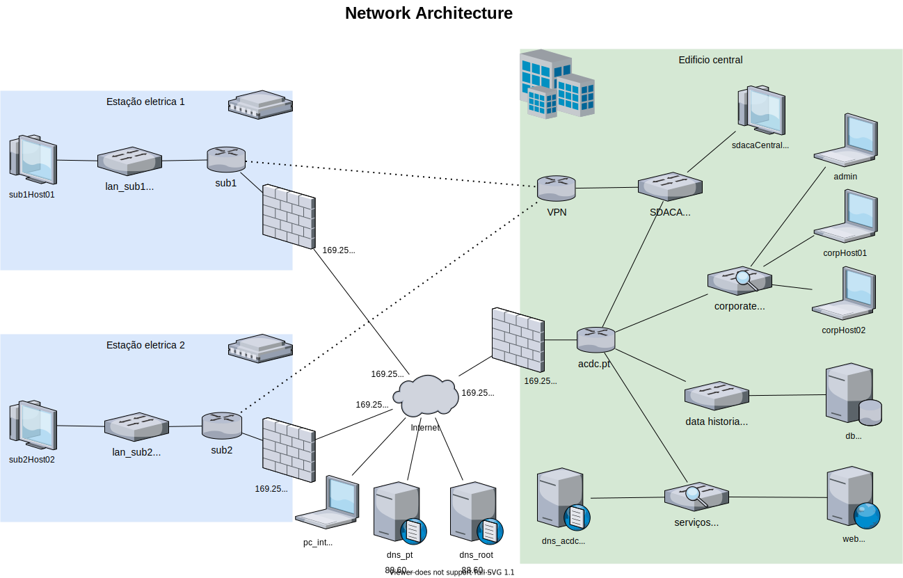

# Relatório do projeto de SIRS

Segurança Informática em Redes e Sistemas 2020-2021, segundo semestre

## Autores

**Grupo 2**

![Samuel Barata][SamuelPhoto] ![Pedro Godinho][PedroPhoto] ![Fábio Sousa][FabioPhoto]

| Número | Nome              | Correio eletrónico                  |
| -------|-------------------|-------------------------------------|
| 94230  | Samuel Barata     | [samuel.barata@tecnico.ulisboa.pt](mailto:samuel.barata@tecnico.ulisboa.pt)   |
| 93608  | Pedro Godinho      | [pedro.f.godinho@tecnico.ulisboa.pt](mailto:pedro.f.godinho@tecnico.ulisboa.pt)     |
| 93577  | Fábio Sousa     | [fabio.sousa@tecnico.ulisboa.pt](mailto:fabio.sousa@tecnico.ulisboa.pt) |

## Introdução

Neste projeto tenciona-se simular uma infraestrutura crítica de informação constituída por um edifício central e duas subestações elétricas. Na rede do edifício central encontram-se dois serviços numa DMZ (um web server e um servidos DNS), bem como um serviço de bases de dados (data historian), uma rede corporate com 3 pcs (2 hosts e um admin) e uma rede SCADA. Adicionalmente, simula-se uma internet simples através de um único router, ao qual estão ligadas as duas subestações, o edifício central, um pc, e 2 servidores de dns, para os domínios root e .pt.

## Diagrama de rede

## Justificação de opções

### Decisões de implementação da rede

#### Internet
- Apenas um router ligado aos edifícios com interfaces link-local
- ligado a um switch de internet onde estão os 2 servidores de DNS e PC
#### Edifício Central
- Apenas implementamos um router com 4 redes
    - Poderíamos ter implementado com 4 VLANs mas achamos que estava fora dos objetivos do projeto
- um switch em cada LAN para ligar todos os dispositivos lá presentes
- os IDSs foram colocados nas saídas do router principal dado que os ataques que entrariam na rede viriam dessa interface
#### SubEstações
- Apenas um router ligado a um switch com a LAN dessa subestação
- o router redireciona o tráfego com destino à LAN scada para a VPN

### Decisões de implementação dos serviços

#### SSH
- utilizador admin adicionado em todos os pcs
    - no da internet e no do admin tem um home directory com as suas chaves ssh
    - nos pcs dos engenheiros tem uma chave duplicada no root directory tem a chave ssh
- os servidores não permitem login com password
#### VPNs
- utilizar uma interface TAP para passar uma rede
- VPN é subrede da rede scada
- apenas implementamos a vpn nos routers das subestações de modo a não ser preciso criar mais clientes se cada subestação tivesse mais computadores na LAN
#### Firewalls
- decidimos usar nftables porque para além das regras serem mais legíveis, já tínhamos experiência passada com ela
- decidimos limitar os pings da internet a 2/sec de modo a prevenir ataques DOS
- todos os ips e interfaces estão definidos em variáveis para mais facilmente modificação de regras no futuro
- para além das regras explícitas no enunciado, permitimos também que a estação ScadaCentral acedesse à base de dados
#### HTTPS
- Não decidimos nada
#### IDS
- Implementado no router principal a escutar as ligações de saida para as redes monitorizadas (corporate, services)
#### DHCP
- Implementamos DHCP na rede Corporate, nas subestações e na LAN scada

## Escolha do IDS

Consultamos alguns artigos, mas focamo-nos principalmente num que tinha comparações dos [melhores NIDS gratuitos](https://www.upguard.com/blog/top-free-network-based-intrusion-detection-systems-ids-for-the-enterprise) que continha uma lista de pros e contras de cada um deles. Escolhemos o Snort porque, para além de termos falado dele na aula, também estava em primeiro lugar na lista deste website. Além disso, é também bastante fácil de configurar.

## Conclusão

Fizemos tudo o que era pedido, apenas não conseguimos acabar a VPN

Experiências passadas facilitaram bastante algumas tarefas, como por exemplo o SSH. No entanto tarefas como HTTPS, em que nunca mexemos, foram mais difíceis. Sentimos que tivemos pouca preparação para a VPN.

Sugerimos deixar as tarefas mais complexas com uma melhor explicação. Sugerimos também ao dar feedback das redes que nós planeamos explicar também algumas das implicações das nossas decisões, pois apesar de poder estar tudo correto podemos mais tarde vir a ter de mudar certas ideas de modo a completar outras tarefas.

[SamuelPhoto]: https://fenix.tecnico.ulisboa.pt/user/photo/ist194230
[PedroPhoto]:  https://fenix.tecnico.ulisboa.pt/user/photo/ist193608
[FabioPhoto]:  https://fenix.tecnico.ulisboa.pt/user/photo/ist193577
